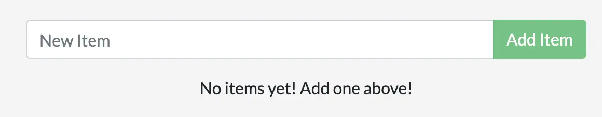
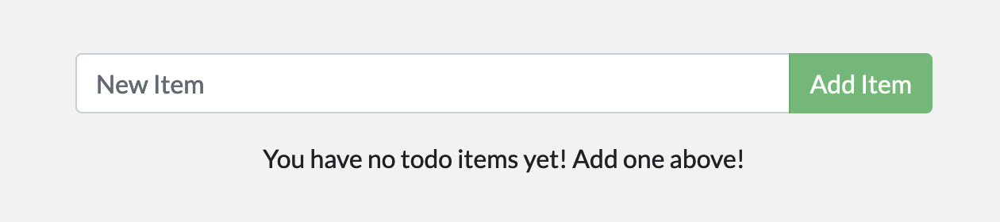

# Docker 활용하기 - 심화

## 애플리케이션 컨테이너화

### 애플리케이션 소스 코드 다운로드

애플리케이션을 실행하기 전에, 먼저 [(getting-started-app)](https://github.com/docker/getting-started-app/tree/main) 저장소에 있는 애플리케이션 소스 코드를 여러분의 기기에 다운로드해야 합니다.

다음 명령어를 사용하여 저장소를 복제합니다.

```bash
git clone https://github.com/docker/getting-started-app.git
```

복제된 저장소의 내용을 확인합니다. 다음과 같은 파일과 하위 디렉토리가 있습니다.

```bash
├── getting-started-app/
    │ ├── .dockerignore
    │ ├── package.json
    │ ├── README.md
    │ ├── spec/
    │ ├── src/
    │ └── yarn.lock
```

### 애플리케이션 이미지 빌드

이미지를 빌드하기 위해서는 Dockerfile이 필요합니다. `Dockerfile`은 확장자가 없는 텍스트 기반 파일로, 컨테이너 이미지를 빌드하기 위한 명령어 스크립트를 포함하고 있습니다. Docker는 이 스크립트를 사용하여 컨테이너 이미지를 빌드합니다.

복제한 getting-started-app 디렉토리에서, `package.json` 파일과 동일한 위치에 `Dockerfile`이라는 파일을 생성하고 다음 내용을 추가합니다.

```bash
# syntax=docker/dockerfile:1

FROM node:lts-alpine
WORKDIR /app
COPY . .
RUN yarn install --production
CMD ["node", "src/index.js"]
EXPOSE 3000
```

이 `Dockerfile`은 `node:lts-alpine` 기본 이미지로 시작합니다. 이 이미지는 `node.js`와 `yarn` 패키지 관리자가 미리 설치된 경량 Linux 이미지입니다. 모든 소스 코드를 이미지에 복사하고, 필요한 종속성을 설치하고, 애플리케이션을 시작합니다.

이미지를 빌드하기 위해서는 다음 명령어를 사용합니다.

```bash
# 터미널에서 getting-started-app 디렉토리로 이동합니다.
cd getting-started-app

# 이미지를 빌드합니다.
docker build -t getting-started .
```

`docker build` 명령어는 `Dockerfile`을 사용하여 새로운 이미지를 빌드합니다. 여러분은 Docker가 많은 "Layer"를 다운로드했음을 알 수 있습니다. 이는 `node:lts-alpine` 이미지를 시작하도록 지시했기 때문입니다. 그러나 여러분의 기기에 그 이미지가 없었기 때문에, Docker는 이미지를 다운로드해야 했습니다.

Docker가 이미지를 다운로드한 후, `Dockerfile`에 있는 명령어들이 애플리케이션을 복사하고, `yarn`을 사용하여 애플리케이션의 종속성을 설치했습니다. `CMD` 지시어는 이미지를 시작할 때 기본적으로 실행할 명령어를 지정합니다.

마지막으로, `-t` 플래그를 통해 새롭게 빌드될 여러분의 이미지에 태그를 지정합니다. 이는 일반적으로 사람이 읽기 쉬운 이름이라고 생각하면 됩니다. 여러분이 이미지에 `getting-started`라는 이름을 지었기 때문에, 이 이미지를 실행할 때 `getting-started`로 참조할 수 있습니다.

`docker build` 명령어의 끝에 있는 `.`은 Docker에게 Dockerfile이 현재 디렉토리에 있음을 알려줍니다.

### 애플리케이션 컨테이너 실행

이제 이미지가 있으므로, `docker run` 명령어를 사용하여 컨테이너에서 애플리케이션을 실행할 수 있습니다.

```bash
docker run -d -p 8080:3000 getting-started
```

`-d` 플래그(긴 형태는 `--detach`)는 백그라운드에서 컨테이너를 실행하는 옵션입니다. 즉, Docker가 컨테이너를 실행하고 터미널 프롬프트로 돌아온다는 의미입니다.

`-p` 플래그(긴 형태는 `--publish`)는 호스트와 컨테이너 간의 포트 매핑을 생성합니다. `-p` 플래그는 `HOST:CONTAINER` 형식의 문자열 값을 받아들이는데, 여기서 `HOST`는 호스트의 주소이고 `CONTAINER`는 컨테이너의 포트입니다. 이 명령어는 호스트의 8080 포트에 대한 연결을 컨테이너의 포트 3000으로 연결합니다. 포트 매핑이 없으면, 호스트에서 애플리케이션에 접근할 수 없습니다.

이제 AWS Cloud9에서 상단 `Tools > Preview > Preview Running Application` 을 클릭하면 현재 실행 중인 애플리케이션을 확인할 수 있습니다.



몇 개의 아이템을 추가하고, 작동하는 것을 확인합니다. 아이템을 완료로 표시하고 제거할 수 있습니다. 프론트엔드를 통해 백엔드에 성공적으로 저장되는 것을 확인할 수 있습니다.

이제, 몇 개의 아이템이 있는 실행 중인 todo 목록 관리자가 있습니다.

컨테이너를 빠르게 살펴보면, 최소한 하나의 컨테이너가 `getting-started` 이미지를 사용하고 포트 3000에서 실행 중인 것을 볼 수 있습니다.

컨테이너를 보려면 CLI 또는 Docker Desktop의 그래픽 인터페이스를 사용할 수 있습니다.

터미널에서 `docker ps` 명령어를 실행하여 컨테이너를 목록으로 확인합니다.

```bash
docker ps
```

다음과 같은 출력이 나타납니다.

```bash
CONTAINER ID        IMAGE               COMMAND                  CREATED             STATUS              PORTS                      NAMES
4bdc4ab12c1e        getting-started     "docker-entrypoint.s…"   3 seconds ago       Up 2 seconds        0.0.0.0:8080->3000/tcp, :::8080->3000/tcp   dazzling_allen
```

## 애플리케이션 업데이트

앞서의 과정을 통해 여러분은 TODO 애플리케이션을 컨테이너화했습니다. 이번에는 애플리케이션과 이미지를 업데이트하고, 컨테이너를 중지하고 삭제하는 방법을 배웁니다.

### 소스 코드 업데이트

아래 소스코드 수정을 통해, TODO 아이템이 없을 때의 메시지를 "You have no todo items yet! Add one above!"로 변경합니다.

1. `src/static/js/app.js` 파일의 56번째 줄을 수정합니다.

```javascript
- <p className="text-center">No items yet! Add one above!</p>
+ <p className="text-center">You have no todo items yet! Add one above!</p>
```

2. `docker build` 명령어를 사용하여 이미지를 빌드합니다.

```bash
docker build -t getting-started .
```

3. 새로 빌드한 이미지를 사용하여 컨테이너를 실행합니다.

```bash
docker run -dp 8080:3000 getting-started
```

아래와 같은 에러가 발생할 수 있습니다.

```bash
docker: Error response from daemon: driver failed programming external connectivity on endpoint suspicious_raman (04fc4f2727d6811c6e3d644bc9cbd932092d84bae69a9afa2e0651ccf1a2470c): Bind for 0.0.0.0:8080 failed: port is already allocated.
```

이 에러는 이전에 실행 중인 컨테이너가 여전히 실행 중이기 때문에 발생합니다. 이전 컨테이너가 8080 포트를 사용하고 있기 때문입니다. 이를 해결하기 위해서는 실행 중인 이전 컨테이너를 삭제해야 합니다.

### 실행 중인 컨테이너 삭제

컨테이너를 삭제하기 위해서는 먼저 컨테이너를 중지해야 합니다. 중지된 후에는 컨테이너를 삭제할 수 있습니다. 터미널에서 다음 명령어를 사용하여 컨테이너를 삭제합니다.

```bash
# 실행 중인 컨테이너의 ID를 확인합니다.
docker ps

# 컨테이너를 중지합니다.
docker stop <the-container-id>

# 컨테이너를 삭제합니다.
docker rm <the-container-id>
```

force 플래그를 활용하여 삭제와 종료를 한번에 할 수 있습니다. <br>
`docker rm -f <the-container-id>`

### 업데이트된 애플리케이션 컨테이너 실행

이제 업데이트된 애플리케이션을 실행합니다.

```bash
docker run -dp 127.0.0.1:3000:3000 getting-started
```

AWS Cloud9의 Preview 화면에서 좌측 새로고침 버튼을 통해 업데이트된 애플리케이션을 확인할 수 있습니다.

